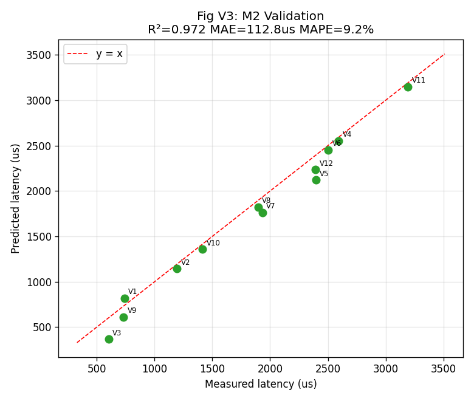
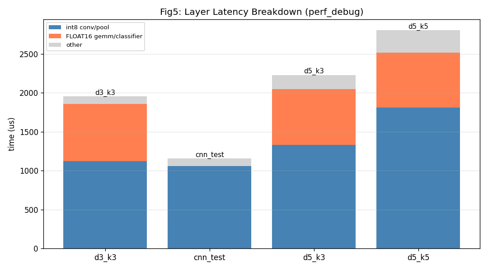
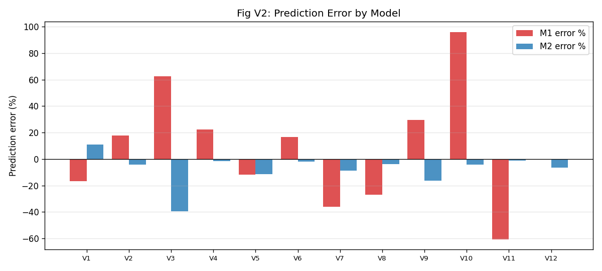
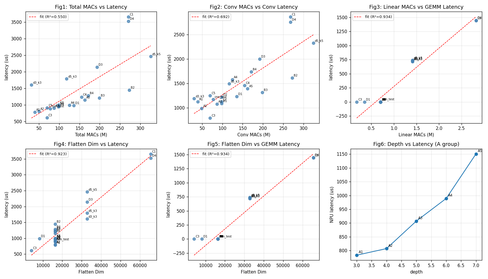

# RK3566 Hardware Performance Model

**工程化封装**：把已验证的 RK3566 实验成果整理为可调用、可验证的性能模型与过滤流水线。
**日期**：2026-09-01

---

## 1. 目标

在不运行 RK3566 实机的情况下，对任意 CNN 结构估算 latency 与内存，
并判断其是否满足硬件约束——为下一阶段 Hardware-aware Model Search 提供基础设施。

```
CNN Config → Architecture Analyzer → Hardware Features
                                      ↓
                              Latency Predictor (验证 R²=0.972)
                                      ↓
                              Memory Estimator (estimated)
                                      ↓
                              Hardware Constraint Filter
                                      ↓
                                   feasible / reject
```

## 2. 代码结构 (hpm 包)

| 模块 | 功能 | 关键接口 |
|------|------|---------|
| `hpm/architecture.py` | 静态架构分析（不依赖实机） | `analyze_architecture(config)` |
| `hpm/latency.py` | latency 模型（加载/拟合/预测） | `RKNNLatencyModel.load()`, `predict_latency(profile)` |
| `hpm/memory.py` | 内存估算（estimated） | `estimate_memory(profile)` |
| `hpm/filter.py` | 硬件约束过滤 | `check_hardware_constraints(profile, constraints)` |
| `hpm/pipeline.py` | 最小 pipeline（搜索接口） | `evaluate_candidate(config, constraints)` |
| `models/rknn_latency_v1.json` | **模型参数（由真实实验拟合）** | — |

## 3. Latency Model

### 公式

$$
T_{RK3566}(\mu s) = 3.023 \times MAC_{Conv}(M) + 980.480 \times MAC_{Linear}(M) + 32.04
$$

- **模型类型**：多元线性回归（非神经网络）
- **特征**：conv_macs, linear_macs（单位 M）
- **单位**：us（eval_perf 纯 NPU 计算时间）
- **拟合数据**：22 个模型真实 RK3566 实测（warmup=10, iterations=50, NPU 900MHz）
- **参数来源**：`models/rknn_latency_v1.json`（由 `hpm/latency.py fit` 从实验结果导出，非手写）

### 验证指标（12 个独立模型，未参与拟合）

| 指标 | 值 |
|------|----|
| R² | **0.9721** |
| MAE | **112.8 us** |
| MAPE | **9.2%** |

## 4. 图

### Figure 1: Measured vs Predicted Latency (M2)



12 个独立模型，R²=0.972，MAPE=9.2%，接近 y=x。

### Figure 2: Layer Latency Breakdown



int8 Conv/Pool vs FLOAT16 GEMM 耗时分解——解释为何 MACs ≠ Latency
（flatten≥32768 时出现 FLOAT16 GEMM 瓶颈）。

### Figure 3: Prediction Error by Model



M1（总 MACs）在 V10/V11 误差达 +96%/-61%；M2 误差基本在 ±15% 内。

### Figure 4: Architecture Feature vs Latency



Conv MACs / Linear MACs / Flatten Dim 与 latency 的关系（22 模型控制变量实验）。

## 5. Memory Estimator（第一版，estimated）

```
weight_memory    = params × bytes_per_param (INT8=1 / FP16=2 / FP32=4)
activation_memory = max(每层特征图 C×H×W) × bytes
estimated_memory = weight + max_activation
```

**注意**：这是静态估算，**不等于 RKNN Runtime 真实峰值内存**（未实测验证，标记为 `estimated`）。

示例（medium: d4 [32,32,64,64] int8）：weight≈0.77MB + activation≈0.09MB ≈ 0.86MB。

## 6. Hardware Constraint Filter

```python
constraints = {"max_latency_us": 1500, "max_memory_bytes": 8MB,
               "max_params": 2_000_000}
check_hardware_constraints(profile, constraints)
# -> {"feasible": bool, "latency_us": ..., "memory_bytes": ...,
#     "params": ..., "violations": [...]}
```

示例结果：

| 候选 | 预测 latency | 估计内存 | feasible | 违反 |
|------|------------|---------|----------|------|
| light (d3 [16,32,32]) | 1504us | 1.48MB | ❌ | latency 超 1500us |
| medium (d4 [32,32,64,64]) | 1019us | 0.86MB | ✅ | — |
| heavy (d4 k5 [32,64,64,128]) | 3028us | 1.94MB | ❌ | latency 超 |

## 7. Search 接口（下一阶段使用）

```python
from hpm.pipeline import evaluate_candidate

for arch in generator():            # 下一阶段: 生成候选
    r = evaluate_candidate(arch, constraints)
    if r["feasible"]:
        candidates.append(r)        # 只对可行候选训练
```

## 8. 验收回答

### Q1: 给定 CNN，能否不跑 RK3566 就估算 latency？
**YES**。`predict_latency(analyze_architecture(config))` 即可。

### Q2: 预测依据是什么？
$T=f(MAC_{Conv}, MAC_{Linear})$，**线性回归性能模型**（非神经网络），参数存于 json。

### Q3: 预测模型是否验证过？
**是**。12 个独立模型：R²=0.972，MAE=112.8us，MAPE=9.2%（详见 `docs/rknn_latency_model_validation_report.md`）。

### Q4: 能否判断 CNN 是否超过硬件约束？
**YES**。`check_hardware_constraints` / `evaluate_candidate` 支持 latency/memory/params 约束。

### Q5: Accuracy 是否已进入 Pipeline？
**暂未进入**。由独立训练验证流程提供（队友），后续与 latency/memory 汇合做联合分析。

## 9. Limitations

- latency 模型基于 22 训练 + 12 验证模型，结构覆盖有限（64×64 输入、3-7 层、k3/k5）
- memory 为静态估算（estimated），未经 RKNN Runtime 实测校准
- 未覆盖不同输入尺寸/更大 batch/更多算子类型
- accuracy 未纳入（TODO, 由队友提供）

## 10. Next Step

1. 队友提供 accuracy 数据（model_id → accuracy）
2. Hardware-aware Search：`generator → evaluate_candidate → 训练 → accuracy`
3. Accuracy × Latency × Memory × Params → Pareto Front → 最优模型
4. H618 适配（另一块板子，后续）
